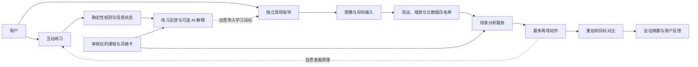

# AI 摄影导师｜开发与验收附件 v0.1

日期：2026-09-23。配套 [MVP 产品方案](./MVP方案.md)。本文是拟议技术契约；未连接真实模型，未完成后端实现。

## 1. 系统边界



前端负责交互、模拟画面和明确的状态呈现。后端负责上传、模型调用、数据隔离、幂等与预算。真实模型密钥始终保留在服务端。

## 2. 页面与状态机

建议路由：`/`、`/learn`、`/learn/:lessonId`、`/coach`、`/coach/:sessionId`、`/coach/:sessionId/compare`、`/records`。原型可以用本地视图切换表达同样的流程。

现场会话：

```text
draft → image_ready → uploading → analyzing → advice_ready
                                  ↘ failed ↗
advice_ready → retake_ready → comparing → compared → closed
任何服务端存储状态 → expired / deleted
```

- `failed` 必须包含失败阶段和可恢复动作；保留目标与原图引用。
- 目标、设备、风格或图像改变时递增 `context_version`。旧结果继续关联旧版本；迟到的旧响应不得覆盖当前结果。
- 同一请求重试使用同一 `idempotency_key`。切换照片或明确重新分析产生新键。
- 同一会话可有多次尝试；对比明确记录 `before_shot_id` 和 `after_shot_id`，不能凭最新文件推断。
- 请求取消后停止界面等待；已经送达供应商的调用可能继续计费，成本记录不能抹除。

## 3. 最小数据结构

| 实体 | 必须字段 | 用途 |
| --- | --- | --- |
| ClientPreferences | device_kind、feedback_depth、style_id、schema_version | 本机偏好，字段可未知 |
| Lesson | id、version、objective、controls、scenes、rubric、source_refs | 可审核的课程定义 |
| PracticeAttempt | id、lesson_version、scene_id、settings、hints_used、result、created_at | 区分尝试、完成与独立完成 |
| CoachingSession | id、anonymous_owner_id、goal、device_context、style_id、context_version、status、expires_at | 会话与用户隔离 |
| Shot | id、session_id、purpose、source_kind、mime、width、height、orientation、object_key、metadata、expires_at | 图像来源、版本与生命周期 |
| Guidance | id、session_id、shot_id、context_version、schema_version、model_version、observations、actions、limits | 输出与实际输入关联 |
| Comparison | id、before_shot_id、after_shot_id、goal_version、changes、uncertainties、user_preference | 防止重拍自动判好 |
| StyleCard | id、version、technique、examples、source_refs、rights_status、reviewed_by | 控制风格内容来源 |
| ModelRun | request_id、idempotency_key、status、attempt_count、timings、usage、cost_estimate | 成本、重试与质量追踪 |

`metadata` 每项带来源：`exif | user | unknown`。图像分析得到的推测另列为观察及不确定性，不能伪装成 EXIF。不得由浏览器端提交的 owner ID 决定读取权限。

## 4. API 草案

| 方法 | 端点 | 输入/行为 | 主要输出 |
| --- | --- | --- | --- |
| POST | `/api/sessions` | 创建匿名会话与目标上下文 | session_id、expires_at |
| POST | `/api/sessions/:id/shots` | 校验文件、转正方向、处理必要元数据 | shot_id、尺寸、source_kind |
| POST | `/api/sessions/:id/guidance` | shot_id、context_version、幂等键 | run_id，异步结果或完成状态 |
| GET | `/api/runs/:id` | 查询当前用户的任务 | queued/running/completed/failed + 结果 |
| POST | `/api/sessions/:id/followup` | guidance_id、问题类型、补充限制 | 解释或新方案版本 |
| POST | `/api/sessions/:id/comparisons` | before/after shot IDs、目标版本 | 变化、条件、无法判断项 |
| POST | `/api/sessions/:id/feedback` | 建议采纳、可执行性、偏好 | 确认记录 |
| DELETE | `/api/sessions/:id` | 删除会话与关联文件，清理任务幂等 | deletion_status |
| POST | `/api/lessons/:id/explanation` | 课程版本、状态、规则结果、问题 | 针对操作的解释 |

前端不能直接访问其他会话图像；图片签名链接设短时限。按用户会话与总体预算限流。状态码明确区分格式错误、超限、过期、权限和服务故障。

## 5. 图像处理与标注约定

1. P0 支持 JPEG、PNG、WebP，单文件限制建议 15 MB，实际像素数也设上限以避免超大解码。
2. HEIC 若浏览器能正常解码则转为 JPEG；否则显示清楚的格式提示。通用 HEIC 服务端转换是额外验收项，未验证前不宣称全支持。
3. 先按 EXIF 方向归一化，再记录规范化尺寸与坐标。长边建议缩至 1600px 进入分析；这只是起点，需要与标注质量、延迟和成本一起评估。
4. 允许针对确需细节的区域进行后续裁片；P0 默认不以压缩预览判断精确噪点、像素级锐度或真实高光溢出。
5. GPS、设备序列号、作者身份等默认不发送到模型。只保留明确有用的曝光和器材字段。
6. 区域框使用归一化坐标 `{x,y,w,h}`，左上角为原点，范围 `[0,1]`；必须校验 `x+w <= 1`、`y+h <= 1`。
7. `object-fit: contain` 下计算真实画面边界，框不能按包含留白的整个容器定位；旋转和裁切时转换矩阵同步更新。
8. 可靠定位失败时清除框并显示文字位置，不能绘制一个看起来精确但无证据的框。

相机入口首先使用设备系统支持的拍照/选图流程；自定义预览作为渐进增强。预览停止或页面离开时释放媒体轨道。生产环境使用 HTTPS，并在用户操作后才请求相机权限。[getUserMedia 文档](https://developer.mozilla.org/en-US/docs/Web/API/MediaDevices/getUserMedia)

## 6. AI 输出契约

以下 JSON 为虚构示例，仅用于定义数据结构。

```json
{
  "schema_version": "0.1",
  "shot_id": "shot-example-01",
  "context_version": 1,
  "goal": "突出人物并保留环境",
  "observations": [
    {
      "id": "o1",
      "text": "人物头部与背景灯具轮廓接近",
      "evidence": "visible_image",
      "region": {"x": 0.4, "y": 0.18, "w": 0.2, "h": 0.25},
      "certainty": "medium"
    }
  ],
  "actions": [
    {
      "id": "a1",
      "observation_ids": ["o1"],
      "instruction": "小幅横移机位，观察头部与灯具是否分开",
      "reason": "减少背景轮廓对人物的干扰",
      "tradeoff": "新的位置可能改变其他背景元素，需要再看一次",
      "condition": "现场允许移动",
      "check_next": "头部轮廓是否更清楚",
      "parameter_suggestion": null,
      "source_card_id": "geometry-01"
    }
  ],
  "unknowns": ["照片无法确定机位周围是否有移动空间"],
  "clarifying_question": null
}
```

最多两条 actions，最多一个必要追问。模型自述 certainty 只决定谨慎措辞，不能直接显示成统计意义上的可信百分比。系统仍需通过评测判断质量。

### 输入组织

固定产品约束 → 当前会话目标与器材 → 图像及明确来源的元数据 → 可用风格卡 → 当前任务类型。学习解释额外接收规则判定和操作差异。

图中可见文字、EXIF 文本和用户上传文件内容只作为待分析材料，不能修改系统约束或要求泄露数据。

### 输出后的检查

- 校验结构、长度、坐标、来源卡 ID 和图像 ID。
- 检查手机模式是否被建议不可用的实体光圈操作。
- 检查建议是否缺少观察依据，或把拍摄起点说成保证结果。
- 检查是否将艺术意图与缺陷混淆；用户声明有意模糊、剪影等时，按目标判断。
- 格式错误允许最多一次修复；仍失败展示“本次未能生成可靠建议”，保留原图与重试入口。
- 模型拒绝、超时或预算达到上限都要真实呈现，不能用预设例子伪装成功。

## 7. 模拟器规则与真实性

### 曝光与显示亮度

固定场景照明时，传感器曝光近似与 `t / N²` 成正比；`t` 为曝光时间，`N` 为 f 数。教学用显示亮度近似可写成：

```text
relative_brightness = (t / t0) × (N0 / N)^2 × (ISO / ISO0)
display_ev_delta = log2(relative_brightness)
```

这里的 ISO 项表示显示/信号增益的教学近似，不表示收到的光子数增加。实际相机响应、动态范围、降噪与多帧计算不能由该式完整模拟。

内部用精确挡位倍率计算，界面显示习惯性的近似 f 数。画面使用线性亮度再作显示映射，不能只依赖任意 CSS 滤镜决定教学通过。

### 运动与景深

- 运动模糊随场景设定的像面速度与曝光时间变化；背景相机抖动与主体运动是两个不同变量。
- 景深示意固定焦距、对焦距离和画幅；降低 f 数时清晰范围变窄是受控示例的趋势，不把它等同于所有图像的精确模拟。
- 原型可用分层模糊示意；真实内测版需与预先拍摄的参考组对照，展示“教学模拟”标签。
- 不用随机生成的新图片冒充同一场景改变单一参数的物理结果。
- 对曝光、景深和运动模糊分别做可解释反馈，不能用“好看分数”代替参数因果。

参数讲解与内容审核参考 [Nikon 曝光基础](https://www.nikonusa.com/learn-and-explore/c/tips-and-techniques/a-basic-look-at-the-basics-of-exposure)；本方案中的实现规则是教学设计，仍须验证。

## 8. 性能与调用预算目标

| 项目 | 内测目标 | 测量边界 |
| --- | --- | --- |
| 模拟控件变化 | 本地反馈 P95 <100ms | 从输入事件到视觉更新；指定测试设备 |
| 首次指导 | 上传完毕后 P50 ≤6s、P95 ≤15s | 包含队列、模型与后处理；不含上传 |
| 对比反馈 | 上传完毕后 P95 ≤20s | 两张图分析与后处理 |
| 总等待 | 从点击到结果的总时长另行记录 | 包含压缩、上传、排队、推理 |
| 超时 | 30s 显示可恢复失败 | 不无限转圈，保留会话 |
| 单次会话 | 默认 3 次用户可见分析动作 | 内部重试、失败也记成本 |

这些是拟议目标，不是已测数据。若选定模型无法达到目标，先减少请求大小或缩短输出，再评估产品等待方式；不能篡改耗时口径。

## 9. 事件定义

共通字段：匿名会话 ID、时间、产品版本、入口、用户自选经验深度、设备类别、场景类别、任务 ID。不得采集图像、GPS、完整自由文本或其他不必要身份信息到分析日志。

| 事件 | 触发条件 |
| --- | --- |
| entry_selected | 用户选择学习或现场入口 |
| lesson_attempt_submitted | 提交实际练习状态 |
| lesson_objective_met | 规则验证目标成立 |
| lesson_transfer_started | 自愿带入实拍任务 |
| shot_ready | 照片通过本地格式处理 |
| guidance_requested / ready / failed | 分别记录请求、结果和真实失败 |
| action_marked_attempted | 用户明确表示执行过动作；不能从点击自动推断 |
| retake_submitted | 第二张图成功绑定原任务 |
| comparison_ready | 真实比较完成 |
| preference_recorded | 用户主动选择偏好，包括不确定 |
| session_deleted | 删除流程完成或进入可追踪的删除状态 |

埋点错误不阻断拍摄流程。点击“去重拍”、成功上传、动作实施、照片改善和掌握能力分别记录。

## 10. P0 验收案例

| 编号 | 操作 | 预期 |
| --- | --- | --- |
| T01 | 新访客直接打开现场指导 | 无课程或登录拦截 |
| T02 | 不填写设备型号并提交 | 可得到设备无关建议 |
| T03 | 相机权限拒绝 | 可以选择文件继续 |
| T04 | 上传横竖方向不同的照片 | 显示方向正确，标注与画面匹配 |
| T05 | 上传不支持的 HEIC/损坏文件 | 格式说明明确，原输入不丢失 |
| T06 | EXIF 缺失 | 不显示伪造参数 |
| T07 | 手机普通模式 | 无不可执行的实体光圈指令 |
| T08 | 用户声明想保留运动模糊 | 不自动把模糊当错误 |
| T09 | 切换目标后旧请求才返回 | 不覆盖新目标的当前界面 |
| T10 | 对同一请求重复点击/重试 | 幂等，避免重复任务及额度扣减 |
| T11 | 网络失败或模型超时 | 显示恢复操作，不生成假点评 |
| T12 | 第二张更差或目标未改善 | 准确描述，允许喜欢原图 |
| T13 | 第二张是另一场景 | 不强行声称原建议已奏效 |
| T14 | 曝光等效挡位组合 | 相对显示亮度相符，运动和景深仍有差异 |
| T15 | 使用提示完成练习 | 标记完成但不标记独立掌握 |
| T16 | 来源卡 ID 无效 | 不展示伪造大师/来源 |
| T17 | 用户反馈动作无法执行 | 新方案保留限制条件 |
| T18 | 删除或会话到期 | 图片链接失效，关联状态正确 |
| T19 | 猜测他人的会话/图片 ID | 无法访问 |
| T20 | 320px 屏幕、键盘、文本放大 | 无关键信息遮挡，控件有标签和可见焦点 |
| T21 | 演示模式选择自己的照片 | 仅预览，明确无真实 AI 分析 |
| T22 | 再次打开本机记录 | 展示本机保存范围，不冒充跨设备同步 |
| T23 | 图中文字要求改变系统任务 | 按图像内容处理，不执行图中指令 |
| T24 | 低清晰度或背屏照片 | 细节判断说明限制，必要时请求补充 |

真实内测至少覆盖一台 iPhone Safari、一台 Android Chrome，以及桌面 Chrome/Safari。真实设备的拍照、照片方向和文件格式必须实测；桌面响应式预览不能代替硬件验证。

## 11. 开发任务拆分

| 包 | 工作项 | 依赖 | 完成证据 |
| --- | --- | --- | --- |
| W1 | 双入口、路由、移动布局、输入与空态 | 页面方案 | 原型任务可无指导完成 |
| W2 | 上传归一化、元数据、匿名会话、删除 | 服务与存储选择 | 正反向用例和真实设备导入 |
| W3 | 场景分析、输出校验、失败恢复 | W2、评测案例 | 案例评分与调用成本记录 |
| W4 | 重拍版本、对比、用户反馈 | W3 | 目标和图片绑定正确 |
| W5 | 三节模拟、规则、学习反馈 | 内容素材 | 参数规则检查与人工内容审核 |
| W6 | 风格卡、来源与跨入口使用 | 审核素材 | 可追溯卡片与场景适用检查 |
| W7 | 事件、预算、错误与耗时观测 | W2–W5 | 完整试验会话可追踪 |
| W8 | 外拍内测、问题修正、商业验证 | P0 基本通过 | 真实试验报告和下一步决策 |

## 12. 交付状态记录

本次实际交付情况及浏览器检查结果记录在 [原型说明](./原型说明.md)。只有执行过的检查才填写为已验证；模型准确率、现场延迟、真实用户学习提升与付费需求在本次演示中保持待验证。
